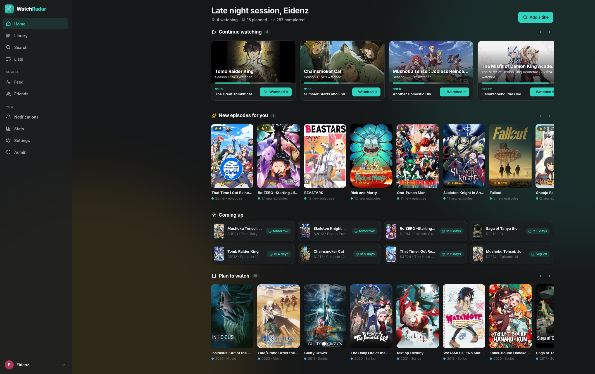

# 📡 WatchRadar



Track the movies and series you watch, and keep an eye on what's next.

WatchRadar is a small self-hosted tracker built around one idea: **your viewing history should
never get in the way of what you want to do next**. Rewatch a whole show, rewatch one episode,
cut a two-cour season in half, mark twenty episodes at once, or forget a show for a year and
get told when its next season lands. Nothing resets, nothing blocks.

## Features

- **Library** with five statuses (Watching, Plan to watch, Completed, On hold, Dropped), search,
  genre/type/rating/decade filters and every sort you'd expect.
- **Episode tracking** with "mark up to here", "mark season", per-episode viewing counts and a
  full viewing history you can edit.
- **Play-throughs**: rewatch a series without losing the record of your first watch. Movies count
  viewings. One-off episode rewatches are logged separately and never disturb your progress.
- **Season cuts**: split any season into parts (Part 1 / Part 2 / …). Progress, "up next" and
  episode numbering follow the parts, and cuts survive TMDB refreshes.
- **The radar**: a background scheduler resyncs tracked titles from TMDB, notifies you about new
  seasons and episodes, and (optionally) moves completed shows back to Watching when new episodes
  air. Home shows what aired today and what's coming in the next three weeks.
- **Ratings** in half stars, private notes, per-title privacy, custom ordered lists.
- **Social**: friends, activity feed, reviews visible to friends, public profiles with stats and
  achievements, shareable title/profile links with Open Graph + oEmbed previews.
- **Stats**: hours watched, monthly activity, favourite days, rating spread, decades, genres, most
  rewatched, 50+ achievements.
- **Import** from MyAnimeList (XML) and Watcharr (JSON); **export** everything as JSON.
- **Migration** from WatchRadar v1 — see below.
- Light/dark theme, works on phones, admin panel.

## Stack

Node 22 · Express 4 · better-sqlite3 · Svelte 5 + Vite. One process serves the API and the built
client. Data lives in a single SQLite file.

## Run it

### Docker (recommended)

```bash
cp .env.example .env      # set TMDB_API_KEY
mkdir -p data
docker compose up --build -d
```

Open <http://localhost:3000>. The first account created becomes the admin.

### Locally

```bash
npm install
cp .env.example .env      # set TMDB_API_KEY
npm run dev               # API on :3000, Vite dev server on :5181
```

`npm run build && npm start` runs the production build. `npm test` runs the server test suite,
`npm run check` type-checks the client.

## Configuration

All settings are environment variables; see [`.env.example`](.env.example). The only required
one is `TMDB_API_KEY`. Set `TRUST_PROXY=true` behind a reverse proxy so secure cookies and client
IPs work. `ALLOW_REGISTRATION=false` closes sign-ups (the very first account is always allowed).

## License

MIT
